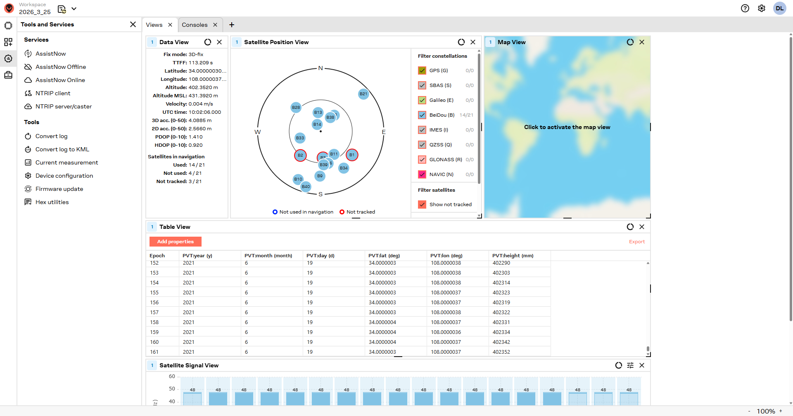
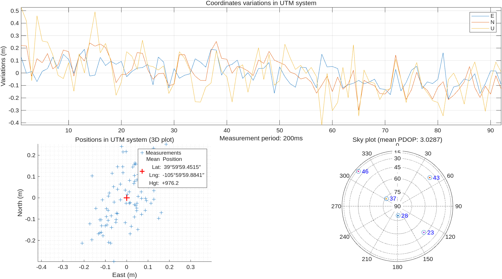

# Beidou-SDR-SIM
An open-source tool for generating  Beidou Navigation Satellite B1C Signal.

## Requirements

1. g++
2. Cmake
3. UHD (usrp api and dev library)

#### Installation

```
git clone https://github.com/Haiyang-Wong/Beidou-SDR-SIM.git
cd Beidou-SDR-SIM
mkdir build && cd build
cmake ../
make
```

#### Simulation parameters (configured in main.cpp)

| Parameters      | Description                                    | Default value  |
| :-------------- | ---------------------------------------------- | -------------- |
| `opt.iduration` | Simulation duration (seconds)                  | 37             |
| `opt.llh`       | Location (latitude °, longitude °, altitude m) | (34, 108, 450) |
| `elvmask`       | Elevation mask (degrees)                       | 10             |
| `SAMP_RATE`     | Sampling rate (Hz)                             | 30.69e6        |

#### Execution

```
./BDS_SDR_SIM
```

This project will generate baseband I/Q sampling data and output it to `data/output/` directory. The sampled data can be transmitted using the SDR (USRP B210) and verified using U-blox and Beitian receivers, as well as using the software receiver [CU-SDR-Collection](https://github.com/gnsscusdr/CU-SDR-Collection). Some results are shown below.





### Future work

- Project optimization and bug fixes
- Integrate **GPS L1** and **Galileo E1B** signal
- User interaction, customizable configuration

## Acknowledgements

- [GPS-SDR-SIM](https://github.com/osqzss/gps-sdr-sim) and [GALILEO-SDR-SIM](https://github.com/harshadms/galileo-sdr-sim) has been an inspiration to start this project.